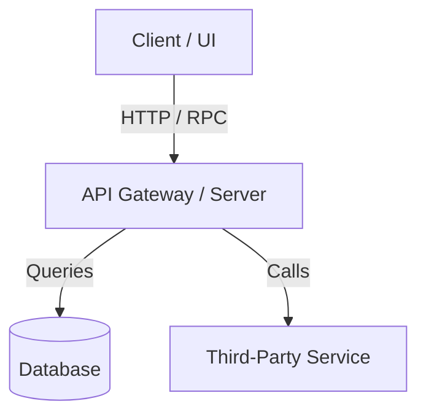

# Graphify — Codebase Knowledge Graph & Structural Indexing

The **graphify** skill generates and queries a structural knowledge graph of codebases. Instead of repeated brute-force file tree scanning or grep searches that consume significant context tokens, graphify extracts and maintains a persistent structural map of files, imports, modules, classes, and call hierarchies.

---

## When to Use

- When first exploring or onboarding to a complex or unfamiliar codebase.
- When planning multi-module architectural refactors or dependency audits.
- When generating architecture diagrams, module relationship maps, or `GRAPH_REPORT.md`.
- When an agent needs an indexed structural reference to query file connections without repeated raw file dumps.

---

## Graph Model & Taxonomy

Graphify structures codebase knowledge into **Nodes** and **Edges**:

### Node Types
- `Module / File`: Source file paths, language, and responsibility summaries.
- `Symbol / Definition`: Classes, interfaces, functions, methods, endpoints, database models.
- `External Dependency`: Third-party packages, external APIs, and database connections.
- `Data Flow / Schema`: Tables, DTOs, request/response models.

### Edge Types
- `IMPORTS` / `DEPENDS_ON`: File A imports File B / Package X.
- `CALLS` / `INVOKES`: Function X executes Function Y.
- `EXTENDS` / `IMPLEMENTS`: Class A inherits from Class B.
- `READS_FROM` / `WRITES_TO`: Endpoint/function queries or writes to Database table T.
- `SENDS_TO` / `RECEIVES_FROM`: Component A sends messages/requests to Component B.

---

## Workflow & Step-by-Step Instructions

### Step 1: Scan Directory Structure & Entry Points
1. Identify primary repository entry points:
   - Web / API entrypoints: e.g., `main.py`, `api.py`, `server.js`, `index.ts`, `app.py`.
   - Browser extensions: `manifest.json`, `background.js`, `content.js`.
   - Configuration & Schemas: `.env.example`, `schema.sql`, `prisma.schema`, `models.py`.
2. Map top-level directory responsibilities (e.g., `backend/`, `extensions/`, `frontend/`, `tests/`).

### Step 2: Extract AST Relationships & Module Graph
For each major component, extract:
- **Imports & Dependencies**: What modules are brought into each file?
- **Exported Symbols**: What functions, classes, and endpoints does the file expose?
- **Data Flow**: Where does data enter, transform, and persist?

### Step 3: Generate `GRAPH_REPORT.md` (or update in-memory graph)
Produce a clear markdown report covering:
1. **Repository Topology**: Summary table of files, sizes, roles, and primary dependencies.
2. **Mermaid Flowchart**: Visual architecture graph connecting layers (UI -> Background -> API -> DB -> External).
3. **Data Schema & Models**: Key entities, column definitions, and primary keys.
4. **Call & Request Pathways**: Step-by-step trace of critical user actions or API requests.

---

## Example Output Structure (`GRAPH_REPORT.md`)

```markdown
# Repository Knowledge Graph

## Architecture Diagram


## Component Directory Map
| Component | Primary Files | Depends On | Purpose |
|---|---|---|---|
| Extension Content | `content.js` | Apollo DOM | DOM scraping, row decoration, local storage |
| Extension Service Worker | `background.js` | `content.js`, API | Message passing, HTTP proxy |
| API Service | `api.py` | PostgreSQL, OpenAI | Duplicate matching, domain normalization |

## Critical Call Flows
1. **Search & Check Flow**: `content.js` (DOM extract) -> `background.js` (proxy) -> `api.py` (POST /match-apollo) -> PostgreSQL `contacts` (batch query) -> `company_matches` -> `resolve_contact_domains` -> DOM highlight.
```

---

## Best Practices
- **Progressive Disclosure**: Keep high-level graph summaries concise; only drill down into inner function ASTs when actively analyzing specific subsystems.
- **Deduplication**: Do not re-parse unchanged files; use timestamps or hashes if maintaining an active index.
- **Visual Clarity**: Use Mermaid syntax for visual relationship representation.
