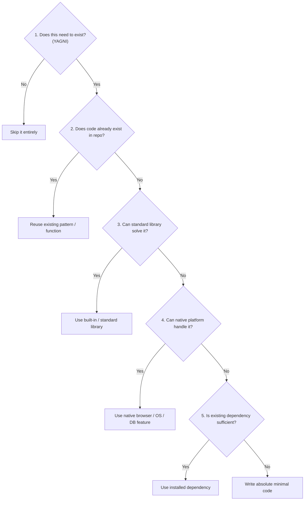

# Ponytail — The Pragmatic "Lazy Senior Developer" Skill

The **ponytail** skill embodies the seasoned senior developer philosophy: **"The best code is the code you never had to write, test, or maintain."**

It forces an agent to resist premature abstractions, avoid unnecessary dependencies, and aggressively choose the simplest possible working solution.

---

## Core Principles

1. **YAGNI (You Ain't Gonna Need It)**: Never build for hypothetical future requirements. Solve the concrete problem in front of you today.
2. **Minimal Surface Area**: Fewer lines, fewer abstractions, fewer moving parts = fewer bugs.
3. **Reuse Existing Patterns**: Check if the codebase already contains a helper, query, or utility before writing a new one.
4. **Standard Library First**: Leverage built-in language primitives and standard libraries before pulling in third-party packages.
5. **No Premature Architecture**: A 15-line straightforward function beats a 200-line generic factory pattern with 4 interfaces.

---

## The Decision Ladder

Before writing any new function, class, or file, climb the **Decision Ladder**:



---

## Practical Code Guidelines

### 1. Avoid Abstraction Layers
- ❌ Do NOT create wrappers around wrappers (e.g., `CustomDatabaseManagerServiceFactory`).
- ✅ DO write direct, clean calls (e.g., `with get_connection() as conn:`).

### 2. Prefer Built-in Language Features
- ❌ Do NOT add npm/pip packages for trivial tasks (e.g., `left-pad`, `is-number`, `lodash.get`).
- ✅ DO use built-in methods (e.g., `str.strip()`, `dict.get()`, `Optional Chaining (?. )`, `URL`, `unicodedata`).

### 3. Reject Speculative Configuration
- ❌ Do NOT create elaborate configuration systems for values that are never going to change.
- ✅ DO hardcode sane defaults or use simple environment variables where needed.

### 4. Delete Dead Code
- When refactoring or replacing logic, completely delete obsolete code, comments, and unused imports. Do not leave commented-out zombie code.

---

## Example Comparisons

### Example 1: Extracting URL Domain

**Over-engineered:**
```python
# 50 lines with custom regex, factory class, and protocol abstraction
class DomainExtractorProtocol(Protocol):
    def extract(self, url: str) -> DomainDTO: ...

class EnterpriseDomainExtractor(DomainExtractorProtocol):
    ...
```

**Ponytail (Lazy Senior):**
```python
from urllib.parse import urlparse

def get_domain(url: str) -> str:
    return urlparse(url if "://" in url else f"https://{url}").netloc.lower().lstrip("www.")
```

---

### Example 2: Frontend State Storage

**Over-engineered:**
- Adding Redux, Zustand, custom IndexedDB wrappers, and observable event buses for a simple popup list.

**Ponytail (Lazy Senior):**
- Use `chrome.storage.local` with debounced write. Fast, standard, reliable.

---

## Intensity Modes

- **`ponytail:lite`**: Pragmatic restraint. Refactors away obvious boilerplate while preserving existing architectural styles.
- **`ponytail:full`** *(Default)*: Enforces strict Decision Ladder, eliminates redundant files and unused parameters.
- **`ponytail:ultra`**: Extreme minimalism. Aggressive simplification, one-liners where readable, zero fluff.
