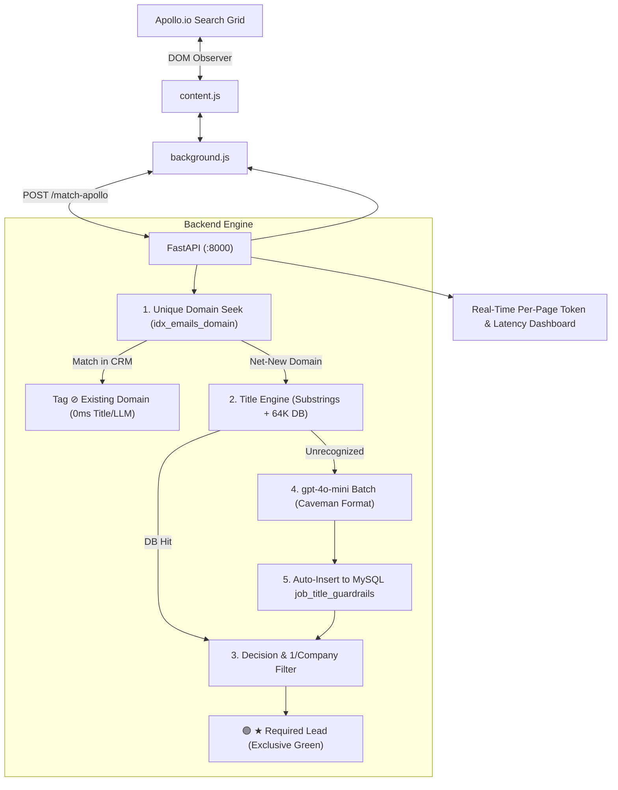
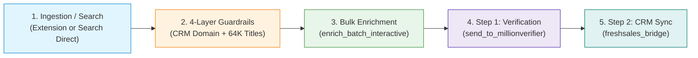

# Apollo Contact Database Checker (v2.0)

A high-performance Chrome Extension and FastAPI backend system for real-time contact duplicate detection, qualification, and lead extraction directly within **Apollo.io**.

> 📖 **Operations Manual**: For the full, detailed guide on all executable commands, testing suites, and CLI utilities, see **[Commands & Operations Guide](docs/COMMANDS_AND_OPERATIONS_GUIDE.md)**.

---

## 1. System Overview

When prospecting on Apollo.io, outreach teams need to filter out existing accounts, prioritize key decision makers, and avoid duplicate outreach. The **Apollo Contact Database Checker** connects Apollo search grids with your AWS RDS MySQL database (7.28M emails) to deliver:

1. **Deterministic CRM Domain Lookups (0.5ms Index Seek):** Automatically checks candidate company domains against 7.28M records. Existing accounts are tagged **`⊘ Existing Domain`** with zero LLM or title lookup overhead.
2. **2-Layer Job Title Evaluation (64K+ Titles):**
   * **Layer 1:** Top-tier executive substring matches (`Chief`, `CEO`, `President`, `Managing Director`, `VP`, `Director`, `Head of`, etc.).
   * **Layer 2:** 64,612 database title rules categorized into 11 Required Segments vs 5 Excluded Segments.
3. **On-Demand LLM Fallback (`gpt-4o-mini`):**
   * Automatically classifies novel/unrecognized titles in batches using ultra-compact Caveman + Ponytail formatting.
   * **Zero-Cost Compounding Cache:** Auto-inserts newly evaluated titles into MySQL `job_title_guardrails` (`ON DUPLICATE KEY UPDATE`) so they resolve instantly at $0.00 cost in future scans.
4. **1 Contact per Company Deduplication:** Automatically accepts the top qualified contact per company as **`🟢 ★ Required Lead`** and marks subsequent duplicates as **`⚪ ⊘ 1/Company Max`**.
5. **Exclusive Green Visual Indicator:** Only target **`★ Required Leads`** receive the green highlight and green badge. Existing domains and excluded titles display neutral gray tags.
6. **1-Click Apollo-Compliant CSV Export:** Exports all collected required leads across pages in standard Apollo format (`First Name, Last Name, Title, Company, Company Domain, Location, Person Linkedin Url, Apollo Profile URL`).

---

## 2. Architecture Diagram



---

## 3. Quickstart & Setup Guide (Clone & Run on Any Machine)

### Prerequisites:
* Python 3.10+ installed
* Google Chrome installed
* Git installed

---

### Step 1: Clone the Repository
```bash
git clone https://github.com/ArunK-Nestack/apollo_extension.git
cd apollo_extension
```

---

### Step 2: Install Python Dependencies
```bash
python -m pip install --upgrade pip
pip install -r requirements.txt
```

---

### Step 3: Configure Environment Variables
Create a `.env` file in the project root (or copy `.env.example`):
```bash
cp .env.example .env
```
Fill in your database and OpenAI settings:
```ini
# Database (AWS RDS MySQL)
DB_HOST=kapilcapital.c7kco0ae2ebh.ap-south-1.rds.amazonaws.com
DB_PORT=3306
DB_USER=nestack
DB_PASSWORD=your_password
DB_NAME=apollo_scrapers
DB_TABLE=emails

# OpenAI Configuration (for novel title evaluation)
OPENAI_API_KEY=sk-proj-your-key-here
OPENAI_DOMAIN_MODEL=gpt-4o-mini

# Deduplication & Guardrails
MAX_CONTACTS_PER_COMPANY=1
GUARDRAILS_ENABLED=true
```

---

### Step 4: Start the Backend API & Web Operations Hub
Run the backend server with uvicorn:
```bash
python backend/api.py
```
*The API will start listening at `http://127.0.0.1:8000`.*
*Health check URL:* `http://127.0.0.1:8000/health`
*Web Operations Hub:* **`http://127.0.0.1:8000/batches`** (Dedicated multi-page dashboard for pipeline management, AI search slicing, fleet quota monitoring, MillionVerifier verification, and Freshsales CRM syncing).

---

### Step 5: Load the Chrome Extension
1. Open Google Chrome and navigate to `chrome://extensions/`.
2. Turn on **Developer mode** (toggle in the top-right corner).
3. Click **Load unpacked**.
4. Select the `extensions/` folder inside `apollo_extension/`.
5. Pin the **Apollo Contact Database Checker** icon to your Chrome toolbar.

---

### Step 6: Using on Apollo.io
1. Navigate to any search page on **[https://app.apollo.io](https://app.apollo.io)**.
2. Click the extension icon in the toolbar to activate the floating control dock.
3. Turn **Title Guardrail: ON**.
4. Browse pages: contacts will be highlighted with live badges.
5. Click **Export Required Contacts (CSV)** to download your filtered leads.

---

## 4. Segment Prioritization Rules

### ✅ Required Segments (Can Close, Approve, or Support):
* **`A1_Signer`**: C-Suite & Board economic signers (CEO, CFO, COO, CCO, CRO)
* **`A2_Budget_Holder`**: VP/SVP budget owners (VP Marketing, SVP Sales)
* **`A3_Approver`**: Directors who own the problem/budget line
* **`B1_Champion` / `B1_Champion_Technical`**: Managers & senior technical ICs
* **`B2_Champion_Commercial`**: Commercial leaders, Sales Ops, Commercial Directors
* **`B3_Technical_Evaluator`**: Senior engineers, Architects, Evaluators
* **`B4_Process_Owner`**: PMO, Program Managers, Agile Leads
* **`C1_User`**: End users, Analysts, Quality Engineers, Specialist ICs
* **`D1_Door_Opener`**: Chiefs of Staff, Executive Assistants, Business Partners
* **`D2_Regional_Leader`**: Regional Directors & Managing Directors

### ❌ Excluded Segments:
* **`X1_Procurement`**: Sourcing, Purchasing Specialists
* **`X2_Security_Privacy`**: CISO, Cyber Security, Infosec
* **`X3_Compliance_Quality`**: Regulatory Affairs, Compliance Officers, Legal
* **`C2_Entry`**: Interns, Junior Assistants, Entry Coordinators
* **`A0_Board`**: Non-Executive Board Members

---

## 5. Per-Page Terminal Dashboard

Every Apollo page scan outputs a clean real-time summary in your terminal:

```text
================================================================================
>>> [APOLLO PAGE #1 DASHBOARD] Ingested 25 Contacts | Title Filter: ON
================================================================================
Contacts Summary : Total: 25 | 🟢 Required: 14 | ⚪ Existing/Ignored: 11
Domain Breakdown : Unique Domains: 18 | In CRM: 6 | Net-New: 19
Job Title Engine : DB Cache Hits: 22 | Sent to gpt-4o-mini: 3
Confidence Stats : High (Auto-Accept): 2 | Medium (Review Queue): 1 | Low/Stop: 0
Token Matrix     : Prompt: 260 | Completion: 24 | Total Tokens: 284
Estimated Cost   : $0.000053 USD (11.3 tokens/contact)
Execution Latency: Actual: 620.4ms | Predicted: ~500.2ms (24.8 ms/contact)
================================================================================
```

---

---

## 6. Build & CLI Commands (`package.json`)

Just like modern web applications, the project is configured with standard npm commands:

```bash
# Compile and validate production extension bundle into dist/
npm run build

# Package the extension into dist/apollo-extension.zip for distribution
npm run package

# Start the Python FastAPI backend engine
npm run dev

# Run the full 15/15 automated multi-tester verification suite
npm test

# Run the 666 real-world duplicate regression test
npm run test:guardrails

# Run the extension DOM runtime simulation
npm run test:runtime

# Run all test suites end-to-end
npm run test:all
```

---

## 7. Production Codebase Directory Layout

```text
apollo_extension/
├── api.py                          # Root FastAPI uvicorn entrypoint proxy (`python api.py`)
├── pyproject.toml                  # Modern unified Python project configuration & tool configs
├── package.json                    # NPM extension build pipeline & test commands
├── requirements.txt                # Unified production Python dependencies
├── pyrightconfig.json              # Static type analysis multi-root paths configuration
├── pytest.ini                      # Pytest runner configuration
├── .env.example                    # Clean environment configuration template (all services)
├── .gitignore                      # Production gitignore (blocks large dumps, exports, crx/pem)
├── README.md                       # Comprehensive documentation & setup guide
│
├── backend/                        # FastAPI Backend & Deduplication Engine
│   ├── __init__.py
│   ├── api.py                      # Core REST API, 4-layer CRM defense & MySQL engine
│   ├── enrich_api.py               # Enrich.so router & API endpoints
│   ├── import_csv.py               # Database bulk ingestion utility
│   └── data/                       # Ingestion pipelines & domain cache
│
├── extensions/                     # Apollo.io Chrome Extension (Manifest V3)
│   ├── manifest.json
│   ├── background.js               # Background service worker
│   └── content.js                  # In-page HUD & DOM observer
│
├── extensions_enrich/              # Enrich.so Chrome Extension (Manifest V3)
│   ├── manifest.json
│   ├── background.js
│   ├── content.js
│   └── styles.css
│
├── freshsales_agent/               # Freshsales CRM Integration Agent
│   ├── app/
│   │   ├── clients/freshsales.py   # Freshsales API client & bulk upsert engine
│   │   ├── database/               # SQLite metrics datastore (crm_automation.db)
│   │   ├── services/               # Batch processor, TLD filter, upsert delta engine
│   │   └── config.py               # CRM credentials & settings
│   ├── tests_agent.py
│   └── extract_companies.py
│
├── millionverifier_agent_step1/    # MillionVerifier Bulk Verification Agent
│   ├── app/
│   │   ├── clients/                # MillionVerifier API client
│   │   ├── services/               # Verifier, 75-column categorizer, GDPR filter
│   │   └── config.py
│   ├── verify_cli.py
│   └── tests_categorizer.py
│
├── scripts/                        # Production CLI Operations & Pipelines
│   ├── manage_batches.py           # Interactive batch management dashboard & hub
│   ├── apollo_search_direct.py     # Streaming search scraper & net-new DB saver
│   ├── apollo_search_optimizer.py  # AI keyword slicing & volume discovery engine
│   ├── enrich_batch_interactive.py # Multi-account bulk enrichment CLI
│   ├── send_to_millionverifier.py  # 75-Column bulk email verifier & categorizer (Good/Bad/Risky)
│   ├── freshsales_bridge.py        # Verified 'Good' leads -> Freshsales CRM sync bridge
│   ├── send_apollo_expiry_alert.py # WhatsApp daily cookie/key expiry notifier
│   ├── clean_enriched_export.py    # Sales-ready clean export formatter
│   ├── apollo_export_formatter.py  # Apollo 75-column official schema formatter
│   ├── sync_batch_to_apollo_list.py# Apollo Lists sync & 5,000-row CSV splitter
│   ├── batch_domain_audit.py       # CRM domain & Indian name auditing engine
│   ├── batch_qualification_audit.py# Title hierarchy qualification audit engine
│   ├── domain_resolver_engine.py   # Multi-worker domain resolution engine
│   ├── lead_guardrails.py          # Standalone 4-layer guardrails pipeline
│   ├── build.js                    # Extension bundling script
│   ├── package.js                  # Extension ZIP/CRX packager
│   └── migrations/                 # Historical database migrations
│
├── config/                         # Configuration & Account Vaults
│   ├── apollo_accounts.json        # Configured Apollo accounts (key-masked in logs)
│   ├── apollo_accounts.template.json
│   ├── saved_searches.json         # Authentic Apollo saved searches catalog
│   ├── search_keyword_history.json # Slicing keyword recommendation history
│   └── freshsales_synced_batches.json # CRM synced batch ledger
│
├── data/                           # Data Assets & Binary Caches
│   ├── domain_trie.marisa          # Memory-mapped MARISA prefix trie (~30MB)
│   ├── domain_slugs_cache.txt      # Raw domain slug lexicon
│   └── indian surnames  (2).xlsx   # Indian name exclusion lexicon
│
├── tests/                          # Unified Automated Test Suites
│   ├── conftest.py                 # Pytest subproject environment isolation fixtures
│   ├── run_all_testers.py          # 5-Persona automated QA suite
│   ├── test_hard_guardrails.py     # 4-Layer deduplication unit tests
│   ├── test_apollo_search_direct.py# Search & domain resolver tests
│   ├── test_apollo_search_optimizer.py # Keyword slicing tests
│   ├── test_clean_enriched_export.py # Clean export formatter tests
│   ├── test_domain_resolver_engine.py # DNS domain resolver tests
│   ├── test_enrich_matching.py     # Enrich.so matching tests
│   ├── test_freshsales_bridge.py   # Freshsales CRM bridge tests
│   ├── test_send_to_millionverifier.py # MillionVerifier integration tests
│   ├── test_send_apollo_expiry_alert.py # WhatsApp alert tests
│   ├── test_extension_runtime.js   # Extension DOM simulation
│   └── backend/                    # Backend microservice unit tests
│
├── docs/                           # Architecture & Operational Documentation
│   ├── SYSTEM_ARCHITECTURE.md
│   ├── COMMANDS_AND_OPERATIONS_GUIDE.md
│   ├── DOMAIN_DEDUPLICATION_DESIGN.md
│   ├── SINGLE_CONTACT_WORKFLOW.md
│   └── WORKFLOW_EXTENSION_TECHNICAL_SPEC.md
│
├── exports/                        # Local CSV exports directory (gitignored)
└── scratch/                        # Temporary scratch workspace (gitignored, kept clean)
```

---

## 8. End-to-End Production Pipeline

The system forms an automated 5-stage data lifecycle:



1. **Discovery & Scraping**: Prospecting directly on Apollo.io or streaming search queries via `python scripts/apollo_search_direct.py`.
2. **Deterministic Guardrails**: Live 0.5ms CRM lookup against 7.28M records, 64K title rules, and on-demand `gpt-4o-mini` evaluation with compounding cache.
3. **Multi-Account Bulk Enrichment**: Enriching leads with verified emails across Apollo accounts using `python scripts/enrich_batch_interactive.py`.
4. **Step 1: MillionVerifier Bulk Verification**: 75-column compliant formatting, cleaning, and bulk verification producing partitioned Good, Bad, and Risky datasets via `python scripts/send_to_millionverifier.py`.
5. **Step 2: Freshsales CRM Sync**: 5-layer delta resolution (33-TLD filter, non-destructive tag merging, non-overwrite contact updates) syncing Good leads to Freshsales CRM via `python scripts/freshsales_bridge.py`.
