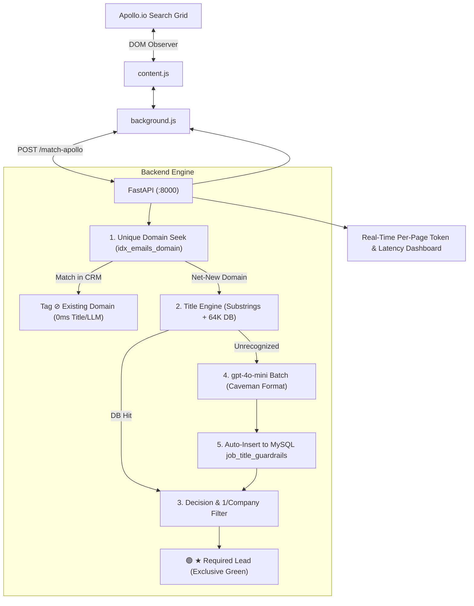

# Apollo Contact Database Checker (v2.0)

A high-performance Chrome Extension and FastAPI backend system for real-time contact duplicate detection, qualification, and lead extraction directly within **Apollo.io**.

---

## 1. System Overview

When prospecting on Apollo.io, outreach teams need to filter out existing accounts, prioritize key decision makers, and avoid duplicate outreach. The **Apollo Contact Database Checker** connects Apollo search grids with your AWS RDS MySQL database (7.28M emails) to deliver:

1. **Deterministic CRM Domain Lookups (0.5ms Index Seek):** Automatically checks candidate company domains against 7.28M records. Existing accounts are tagged **`⊘ Existing Domain`** with zero LLM or title lookup overhead.
2. **2-Layer Job Title Evaluation (64K+ Titles):**
   * **Layer 1:** Top-tier executive substring matches (`Chief`, `CEO`, `President`, `Managing Director`, `VP`, `Director`, `Head of`, etc.).
   * **Layer 2:** 64,612 database title rules categorized into 11 Required Segments vs 5 Excluded Segments.
3. **On-Demand LLM Fallback (`gpt-4o-mini`):**
   * Automatically classifies novel/unrecognized titles in batches using ultra-compact Caveman + Ponytail formatting.
   * **Zero-Cost Compounding Cache:** Auto-inserts newly evaluated titles into MySQL `job_title_guardrails` (`ON DUPLICATE KEY UPDATE`) so they resolve instantly at $0.00 cost in future scans.
4. **1 Contact per Company Deduplication:** Automatically accepts the top qualified contact per company as **`🟢 ★ Required Lead`** and marks subsequent duplicates as **`⚪ ⊘ 1/Company Max`**.
5. **Exclusive Green Visual Indicator:** Only target **`★ Required Leads`** receive the green highlight and green badge. Existing domains and excluded titles display neutral gray tags.
6. **1-Click Apollo-Compliant CSV Export:** Exports all collected required leads across pages in standard Apollo format (`First Name, Last Name, Title, Company, Company Domain, Location, Person Linkedin Url, Apollo Profile URL`).

---

## 2. Architecture Diagram



---

## 3. Quickstart & Setup Guide (Clone & Run on Any Machine)

### Prerequisites:
* Python 3.10+ installed
* Google Chrome installed
* Git installed

---

### Step 1: Clone the Repository
```bash
git clone https://github.com/ArunK-Nestack/apollo_extension.git
cd apollo_extension
```

---

### Step 2: Install Python Dependencies
```bash
python -m pip install --upgrade pip
pip install -r requirements.txt
```

---

### Step 3: Configure Environment Variables
Create a `.env` file in the project root (or copy `.env.example`):
```bash
cp .env.example .env
```
Fill in your database and OpenAI settings:
```ini
# Database (AWS RDS MySQL)
DB_HOST=kapilcapital.c7kco0ae2ebh.ap-south-1.rds.amazonaws.com
DB_PORT=3306
DB_USER=nestack
DB_PASSWORD=your_password
DB_NAME=apollo_scrapers
DB_TABLE=emails

# OpenAI Configuration (for novel title evaluation)
OPENAI_API_KEY=sk-proj-your-key-here
OPENAI_DOMAIN_MODEL=gpt-4o-mini

# Deduplication & Guardrails
MAX_CONTACTS_PER_COMPANY=1
GUARDRAILS_ENABLED=true
```

---

### Step 4: Start the Backend API
Run the backend server with uvicorn:
```bash
python backend/api.py
```
*The API will start listening at `http://127.0.0.1:8000`.*
*Health check URL:* `http://127.0.0.1:8000/health`

---

### Step 5: Load the Chrome Extension
1. Open Google Chrome and navigate to `chrome://extensions/`.
2. Turn on **Developer mode** (toggle in the top-right corner).
3. Click **Load unpacked**.
4. Select the `extensions/` folder inside `apollo_extension/`.
5. Pin the **Apollo Contact Database Checker** icon to your Chrome toolbar.

---

### Step 6: Using on Apollo.io
1. Navigate to any search page on **[https://app.apollo.io](https://app.apollo.io)**.
2. Click the extension icon in the toolbar to activate the floating control dock.
3. Turn **Title Guardrail: ON**.
4. Browse pages: contacts will be highlighted with live badges.
5. Click **Export Required Contacts (CSV)** to download your filtered leads.

---

## 4. Segment Prioritization Rules

### ✅ Required Segments (Can Close, Approve, or Support):
* **`A1_Signer`**: C-Suite & Board economic signers (CEO, CFO, COO, CCO, CRO)
* **`A2_Budget_Holder`**: VP/SVP budget owners (VP Marketing, SVP Sales)
* **`A3_Approver`**: Directors who own the problem/budget line
* **`B1_Champion` / `B1_Champion_Technical`**: Managers & senior technical ICs
* **`B2_Champion_Commercial`**: Commercial leaders, Sales Ops, Commercial Directors
* **`B3_Technical_Evaluator`**: Senior engineers, Architects, Evaluators
* **`B4_Process_Owner`**: PMO, Program Managers, Agile Leads
* **`C1_User`**: End users, Analysts, Quality Engineers, Specialist ICs
* **`D1_Door_Opener`**: Chiefs of Staff, Executive Assistants, Business Partners
* **`D2_Regional_Leader`**: Regional Directors & Managing Directors

### ❌ Excluded Segments:
* **`X1_Procurement`**: Sourcing, Purchasing Specialists
* **`X2_Security_Privacy`**: CISO, Cyber Security, Infosec
* **`X3_Compliance_Quality`**: Regulatory Affairs, Compliance Officers, Legal
* **`C2_Entry`**: Interns, Junior Assistants, Entry Coordinators
* **`A0_Board`**: Non-Executive Board Members

---

## 5. Per-Page Terminal Dashboard

Every Apollo page scan outputs a clean real-time summary in your terminal:

```text
================================================================================
>>> [APOLLO PAGE #1 DASHBOARD] Ingested 25 Contacts | Title Filter: ON
================================================================================
Contacts Summary : Total: 25 | 🟢 Required: 14 | ⚪ Existing/Ignored: 11
Domain Breakdown : Unique Domains: 18 | In CRM: 6 | Net-New: 19
Job Title Engine : DB Cache Hits: 22 | Sent to gpt-4o-mini: 3
Confidence Stats : High (Auto-Accept): 2 | Medium (Review Queue): 1 | Low/Stop: 0
Token Matrix     : Prompt: 260 | Completion: 24 | Total Tokens: 284
Estimated Cost   : $0.000053 USD (11.3 tokens/contact)
Execution Latency: Actual: 620.4ms | Predicted: ~500.2ms (24.8 ms/contact)
================================================================================
```

---

## 6. Project Structure

```text
apollo_extension/
├── backend/
│   ├── api.py                           # Core FastAPI Matching Engine & Dashboard
│   └── data/
│       ├── import_job_titles_pipeline.py# 64K CSV ingestion into MySQL table
│       ├── classify_novel_titles_batch.py# Batch LLM testing & token benchmark script
│       ├── job_titles (2) - job_titles (2).csv # 48,557 newly synced job titles
│       └── novel_titles_needs_llm_1000.csv    # 1,000 benchmark novel titles
├── extensions/
│   ├── manifest.json                    # Chrome Manifest V3 configuration
│   ├── background.js                    # Service worker with dual-host fallback
│   └── content.js                       # Apollo DOM observer, badge injector & CSV exporter
├── requirements.txt                     # Python dependencies
├── .env.example                         # Environment configuration template
└── README.md                            # Comprehensive documentation
```