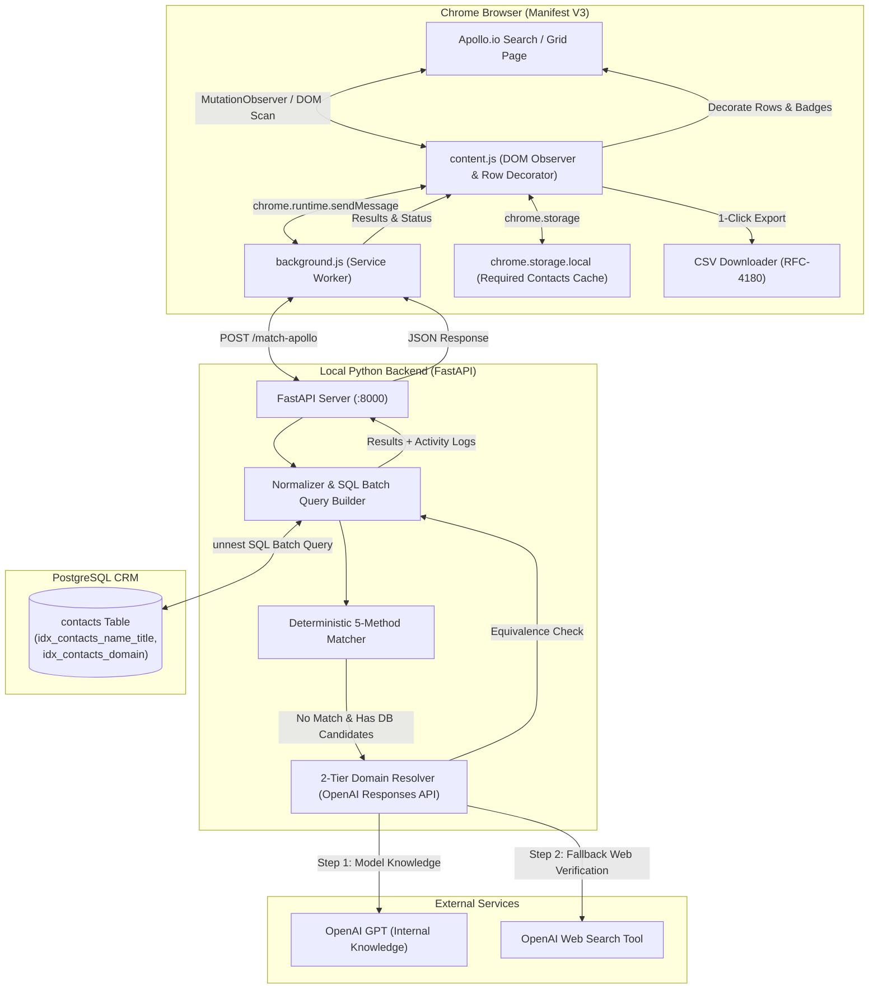
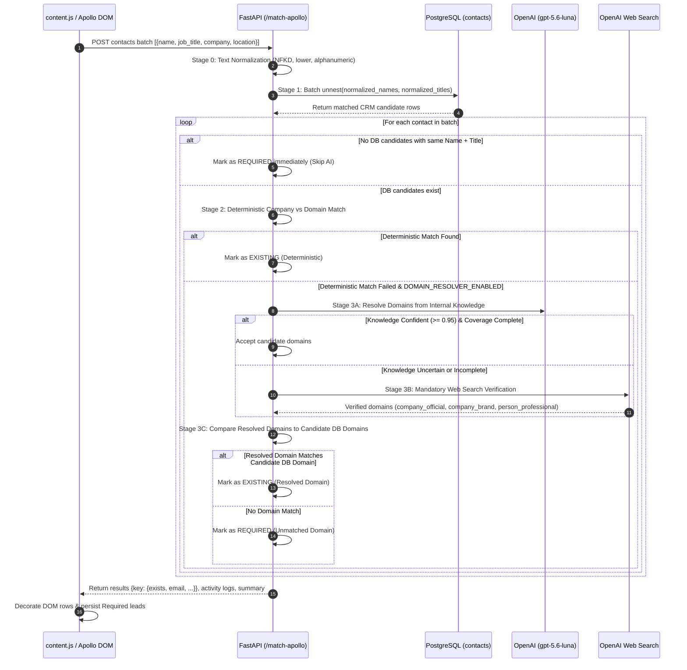

# Apollo Contact Database Checker

A high-performance Chrome extension and FastAPI backend system designed for real-time contact duplicate detection, qualification, and lead extraction directly within **Apollo.io**.

---

## Overview

When prospecting on Apollo.io, sales and outreach teams frequently encounter contacts that already exist in internal CRM databases. The **Apollo Contact Database Checker** bridges Apollo search grids with a local PostgreSQL CRM database to:

1. **Instant Duplicate Detection**: Automatically highlights existing contacts with green badges (`✓ Existing`) and CRM email tooltips as you browse Apollo search pages.
2. **Lead Qualification**: Marks new, uncontacted leads with orange badges (`Required`).
3. **Session Persistence & Export**: Aggregates all `Required` contacts across pages and browser sessions in `chrome.storage.local`, enabling 1-click CSV export (`apollo_id,name,job_title,company,location`) without clicking into individual profiles or consuming unnecessary credits.
4. **Live Activity Telemetry**: Provides a slide-out real-time diagnostic panel displaying execution metrics (Total Checked, Existing Matches, LLM Lookups, Web Searches) and millisecond-level event logging.
5. **Intelligent Multi-Stage Matching**: Uses a high-throughput, deterministic 5-method company-domain matcher with a gated 2-tier AI fallback (OpenAI LLM internal knowledge + verified web search) to resolve ambiguous company names without writing unresolved noise to PostgreSQL.

---

## Architecture & System Design



---

## Key Components

### 1. Chrome Extension (`extensions/`)
- **`manifest.json`**: Manifest V3 extension configuration with `activeTab`, `scripting`, and `storage` permissions.
- **`background.js`**: Background service worker. Listens for extension toggle icon clicks, injects `content.js`, handles message passing (`MATCH_APOLLO`, `CHECK_EMAILS`), measures API round-trip latencies, and provides structured logging.
- **`content.js`**: 
  - **DOM Extraction**: Detects Apollo contact links (`a[href*="/contacts/"]`, `a[data-to*="/contacts/"]`), extracts names, adjacent title and company cells, and resolves optional location headers (`findCellByHeader`).
  - **Settle Retry Engine**: Automatically retries DOM extraction up to 6 times when Apollo's virtualized React grid is still hydrating rows.
  - **MutationObserver**: Selectively monitors row additions while strictly filtering out the extension's own UI mutations.
  - **UI Overlays**: Injects status toasts (`#contact-checker-status`), floating control dock (`#contact-checker-controls`), and a slide-up Activity drawer (`#contact-checker-activity-panel`).
  - **Local Persistence**: Debounces writes of collected `Required` contacts into `chrome.storage.local`.

### 2. FastAPI Backend (`backend/api.py`)
- **FastAPI Endpoints**:
  - `GET /health`: Health check and connectivity status.
  - `POST /check`: Simple direct email batch lookup against PostgreSQL.
  - `POST /match-apollo`: High-performance Apollo contact batch matching and domain resolution engine.
- **Database Connection**: Uses `psycopg` connection pooling to query the local PostgreSQL instance.

---

## Matching Engine & Data Flow

The `/match-apollo` matching pipeline executes in strict chronological stages:



### Deterministic Matching Methods (Stage 2)
1. **Method 1 (Exact Variant Intersection)**: Normalizes company variants against domain brand variants (e.g., `VE GROUP` -> `vegroup` matches `ve-group.com` -> `vegroup`). Handles brandable TLDs like `.ai`, `.io`, `.tech` (e.g., `Liquid AI` <-> `liquid.ai`).
2. **Method 2 (Multi-Token Domain Brand Containment)**: Verifies if 2+ domain brand tokens are a subset of the company token set (e.g., `WSO Worldwide Security Options` <-> `wso-security.com`).
3. **Method 3 (Distinctive First Token Brand)**: Matches the primary distinctive non-generic company token (length $\ge 5$) against the domain brand (e.g., `Simplon Fahrrad GmbH` <-> `simplon.com`).
4. **Method 4 (Compact Prefix/Containment)**: Checks non-generic substrings with length $\ge 6$ (e.g., `ABC Technologies` <-> `abctech.com`).
5. **Method 5 (Acronym Match)**: Extracts company initialisms and tests containment in domain tokens (e.g., `Worldwide Security Options` -> `WSO`).

### AI Domain Resolution Fallback (Stage 3)
- **Scoped Domain Categories**: Restricts resolution strictly to `company_official`, `company_brand`, and `person_professional`. Excludes generic providers (Gmail, Outlook), directories, social media (LinkedIn, Crunchbase), and lead platforms.
- **Coverage-Complete Knowledge Gating**: Only skips web search if the LLM is $\ge 95\%$ confident with complete coverage.
- **Mandatory Web Search Verification**: Enforces live search if model knowledge is ambiguous.
- **Zero PostgreSQL Writes**: AI resolutions remain purely in-memory per request batch, preserving database purity.

---

## Database Schema

```sql
CREATE TABLE IF NOT EXISTS contacts (
    id SERIAL PRIMARY KEY,
    email TEXT NOT NULL,
    first_name TEXT,
    last_name TEXT,
    job_title TEXT,
    normalized_name TEXT,
    normalized_title TEXT,
    email_domain TEXT,
    normalized_domain TEXT,
    source_login TEXT,
    source_file TEXT
);

-- Fast Name + Job Title Composite Index
CREATE INDEX IF NOT EXISTS idx_contacts_name_title 
ON contacts (normalized_name, normalized_title);

-- Fast Domain Lookup Index
CREATE INDEX IF NOT EXISTS idx_contacts_domain 
ON contacts (normalized_domain);
```

---

## Project Structure

```text
apollo_extension/
├── .agents/                      # Workspace Customizations & Agent Skills
│   └── skills/
│       ├── graphify/             # Codebase knowledge graph & AST indexing
│       ├── caveman/              # Ultra-terse, token-efficient communication
│       └── ponytail/             # Senior pragmatic YAGNI & minimal-code enforcement
├── backend/                      # FastAPI matching service & ETL scripts
│   ├── .venv/                    # Python virtual environment
│   ├── data/                     # Source CRM CSV imports
│   ├── api.py                    # Core FastAPI backend & matching engine
│   ├── prepare_matching.py       # DB schema migrations & indexing script
│   ├── import_csv.py             # CSV batch ingestion script (5k chunked commits)
│   ├── data_script.py            # CSV email domain extractor
│   ├── test_match.py             # Deterministic & live resolver test suite
│   ├── debug_company.py          # Interactive company-matching debugger
│   ├── test_db.py                # PostgreSQL connection test utility
│   └── lookup_email.py           # CLI direct email checker
├── extensions/                   # Chrome Extension (Manifest V3)
│   ├── manifest.json             # Extension manifest
│   ├── background.js             # Service worker & API bridge
│   └── content.js                # Apollo DOM parser, decorator, & activity UI
├── .env                          # Backend environment variables
└── README.md                     # Project documentation
```

---

## Setup & Installation

### 1. Prerequisites
- **Python 3.10+**
- **PostgreSQL 14+**
- **Google Chrome** (or Chromium-based browser)
- **OpenAI API Key** (optional, required if `DOMAIN_RESOLVER_ENABLED=true`)

---

### 2. Backend Configuration

1. Create a `.env` file in the project root:
   ```env
   DB_HOST=localhost
   DB_PORT=5432
   DB_NAME=apollo_lookup
   DB_USER=postgres
   DB_PASSWORD=your_postgres_password

   OPENAI_API_KEY=your_openai_api_key
   OPENAI_DOMAIN_MODEL=gpt-5.6-luna

   DOMAIN_RESOLVER_ENABLED=true
   DOMAIN_KNOWLEDGE_MIN_CONFIDENCE=0.95
   DOMAIN_WEB_MIN_CONFIDENCE=0.90
   ```

2. Initialize the Python virtual environment and install dependencies:
   ```bash
   cd backend
   python -m venv .venv
   
   # Windows (PowerShell)
   .\.venv\Scripts\Activate.ps1
   
   # Linux / macOS
   source .venv/bin/activate

   pip install fastapi uvicorn psycopg python-dotenv openai pydantic
   ```

3. Setup database tables and indexes:
   ```bash
   python prepare_matching.py
   ```

4. *(Optional)* Ingest contact data from CSV:
   - Place your CRM CSV file inside `backend/data/`.
   - Run the import script:
     ```bash
     python import_csv.py
     ```

5. Start the FastAPI server:
   ```bash
   uvicorn api:app --host 127.0.0.1 --port 8000 --reload
   ```

---

### 3. Chrome Extension Installation

1. Open Chrome and navigate to `chrome://extensions/`.
2. Enable **Developer mode** (toggle in the top-right corner).
3. Click **Load unpacked**.
4. Select the `extensions/` directory from this repository.
5. The **Contact Database Checker** icon will appear in your Chrome toolbar.

---

## How to Use

1. **Open Apollo**: Navigate to any Apollo.io search results or contact list page (e.g., `https://app.apollo.io/#/people`).
2. **Activate Extension**: Click the Contact Database Checker extension icon in your Chrome toolbar.
3. **Automatic Scanning**: The extension scans rendered contact rows on page load and on dynamic scroll/pagination:
   - **`✓ Existing` (Green)**: Contact already exists in your CRM. Hover over the badge to view their CRM email.
   - **`Required` (Orange)**: Contact is new and not in your CRM.
4. **Activity Drawer**: Click the **Activity** button in the bottom floating dock to view real-time performance metrics and live telemetry logs.
5. **Export Leads**: Click **Export Required Contacts (CSV)** in the dock to download a clean CSV file (`required-contacts-<timestamp>.csv`) of all accumulated new leads.

---

## Testing & Diagnostics

### Run Matching Unit Tests
Run the deterministic unit test suite and domain equivalence checks:
```bash
python backend/test_match.py
```

### Test Live LLM Domain Resolution
Run the interactive resolver test with live OpenAI reasoning and web search:
```bash
python backend/test_match.py --resolve
```

### Debug a Specific Contact Matching Case
Inspect variant generation, tokenization, and database comparison for a specific company name and contact:
```bash
python backend/debug_company.py
```

---

## License

This project is licensed under the MIT License - see the [LICENSE](LICENSE) file for details.