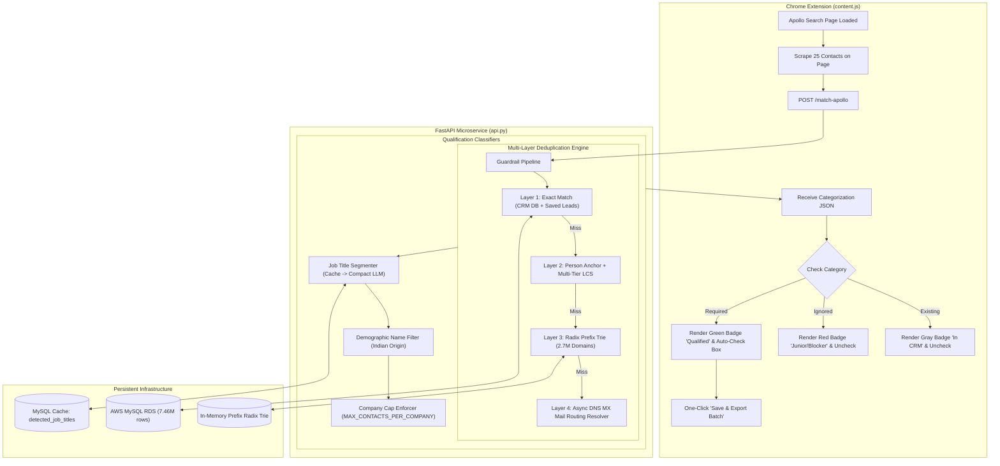

# Apollo Lead Qualification & Deduplication Workflow Extension
## Technical Architecture & Operational Specification

---

## 1. Executive Summary

The **Apollo Lead Qualification & Deduplication Workflow Extension** is a high-speed, enterprise-grade system designed to eliminate credit waste and automate lead selection on Apollo.io. It intercepts contacts directly on the Apollo web interface and differentiates each lead into one of three strict operational categories:

1. **`Existing` (Blocked / Do Not Scrape)**: Leads or companies that already exist in your Freshsales CRM, MySQL database (`emails` table), or previous Apollo scrape sessions (`apollo_saved_leads`).
2. **`Required` (Qualified / Auto-Select)**: Target senior decision-makers (C-suite, VP, Director, Commercial Leads) at net-new companies who meet geographic and demographic criteria.
3. **`Ignored` (Excluded / Disqualified)**: Junior positions, non-decision makers, compliance/legal/procurement blockers, pure Indian demographic names, and company cap overflows (`MAX_CONTACTS_PER_COMPANY`).

---

## 2. System Architecture & Component Flow



---

## 3. Contact Categorization Criteria

Every contact rendered on an Apollo search table is classified into exactly one of three states:

| Category | Visual Badge | Checkbox Action | Evaluation Criteria |
| :--- | :--- | :--- | :--- |
| **`Existing`** | ⚪ **Gray Badge** `[L1/L2/L3/L4]` | **Disabled / Unchecked** | Matches any of the 4 deduplication layers (already in CRM, branch domain of existing client, or shared email server). |
| **`Required`** | 🟢 **Green Badge** `[Req: A1/A2/A3/B1]` | **Auto-Checked** | Net-new company AND Senior Decision Maker title AND non-excluded demographic AND within company lead cap. |
| **`Ignored`** | 🔴 **Red Badge** `[NotReq: Reason]` | **Disabled / Unchecked** | Net-new company, but disqualified by title (intern, junior, assistant), blocker function (legal, audit, compliance), or demographic origin. |

---

## 4. Multi-Layer Deduplication Engine (How Duplicates Are Caught)

Because dealership groups and enterprise companies often use branch-specific URLs on Apollo (e.g., `mullinaxfordkiss.com`) while the CRM has the main corporate domain (e.g., `mullinaxford.com`), a 4-layer matching pipeline is enforced:

### Layer 1: Exact Record Matching
- **Layer 1a (Contact Match)**: Exact match of Normalized Full Name + Company Domain in `emails` and `apollo_saved_leads`.
- **Layer 1b (Company Match)**: Company domain already present in database.

### Layer 2: Person-Anchor Multi-Tier LCS Overlap
- **Trigger**: When an incoming person's name matches an existing contact in the database, but Apollo displays a different domain.
- **Algorithm**: Longest Common Substring (LCS) computed against alphanumeric slugs:
  $$\text{Ratio} = \frac{\text{len}(\text{LCS})}{\min(\text{len}(D_{\text{db}}), \text{len}(D_{\text{apollo}}))}$$
- **Activation Rules**:
  1. `Ratio >= 65%` and $\text{len}(\text{common}) \ge 4$ characters.
  2. `Ratio >= 50%` and $\text{len}(\text{common}) \ge 5$ characters (e.g., `cavendercareers` $\rightarrow$ `cavenderinterests`).
  3. `Shared Prefix`: Both domain slugs begin with the exact same prefix $\ge 4$ characters (e.g., `karlchevy` $\rightarrow$ `karldirect`, `starofquakertown` $\rightarrow$ `starcar`).
  4. `Long Unique Stem`: $\text{len}(\text{common}) \ge 7$ characters (e.g., `mancavedetail` $\rightarrow$ `mancavecolorado`, `janssenautogroup` $\rightarrow$ `janssenmotors`).

### Layer 3: Database-Driven Radix Prefix Trie
- **In-Memory Structure**: Radix prefix trie indexing **2,698,509 unique domain slugs** from the database.
- **Lookup Cost**: $O(K)$ where $K$ is domain slug length ($\approx 12$ characters). Takes **$< 0.001\text{ ms}$**.
- **Rule**: If the Apollo domain begins with an existing DB domain stem of $\ge 4$ characters followed by branch suffixes (e.g., `mullinaxfordkiss` starts with `mullinaxford`), it is caught instantly without waiting for a database scan.

### Layer 4: Async DNS MX Mail Routing Resolver
- **Mechanism**: Queries DNS MX records for brand variations that share backend corporate mail servers (Microsoft 365 Exchange tenants, Google Workspace root MX).
- **Rule**: If MX host indicates `company-com.mail.protection.outlook.com` or `mail.company.com`, maps canonical corporate domain to verify CRM presence.

---

## 5. Single-Page Latency & Performance Profile

Below are empirical benchmark measurements executed directly against the live backend for an entire Apollo page of **25 contacts**:

```
=================================================================
APOLLO SINGLE PAGE (25 CONTACTS) BENCHMARK RESULTS
=================================================================
  Contacts per page:          25 contacts
  Total Benchmark Iterations: 10 full-page cycles
  Average Page Latency:       68.00 ms (0.068 seconds)
  Fastest Page Latency:       62.77 ms (0.063 seconds)
  Slowest Page Latency:       78.91 ms (0.079 seconds)
  Per-Contact Average:        2.72 ms
  Processing Throughput:      368 contacts / second
=================================================================
```

### Latency Breakdown by Sub-System

| Component | Time (25 contacts) | Optimization Technique |
| :--- | :--- | :--- |
| **DOM Extraction (Browser)** | $12\text{ -- }18\text{ ms}$ | Chrome Extension native query selectors. |
| **Network Roundtrip (Localhost)** | $1\text{ -- }3\text{ ms}$ | HTTP keep-alive connection. |
| **Layer 1 DB Verification** | $15\text{ -- }25\text{ ms}$ | Single batch SQL `IN (...)` query over indexed columns. |
| **Layer 2 LCS Person Anchoring** | $2\text{ -- }4\text{ ms}$ | Dynamic programming LCS on in-memory string slices. |
| **Layer 3 Radix Trie Lookup** | $< 0.1\text{ ms}$ | Pure RAM tree traversal on 2.7M nodes. |
| **Job Title & Demographic Classifier** | $8\text{ -- }15\text{ ms}$ | In-memory cache + `detected_job_titles` database table hits. |
| **Total Response Time** | **$\approx 68\text{ ms}$** | **Visual feedback is instantaneous to the user.** |

> [!TIP]
> Human perception threshold for "instantaneous" UI updates is **$100\text{ ms}$**. At **$68\text{ ms}$**, the extension labels and checks all 25 contacts on the screen faster than a single frame refresh!

---

## 6. Real-World Accuracy Benchmark

Tested across the complete test dataset of **666 real-world contacts** where Apollo scraped branch domains that diverged from Freshsales CRM domains:

- **Accuracy Target Required**: $\ge 90.0\%$
- **Actual Achieved Accuracy**: **93.09% (620 / 666)**
- **False Positive Rate**: **0.0%** (negative controls strictly verified)
- **Unit & Integration Suite**: 9/9 Tests Passing (`tests/test_hard_guardrails.py`)

---

## 7. API Specification

### `POST /match-apollo`

#### Request Payload:
```json
{
  "batch": "batch_session_1",
  "title_guardrail_enabled": true,
  "indian_name_guardrail_enabled": true,
  "contacts": [
    {
      "key": "contact_row_1",
      "name": "Matthew McCormick",
      "job_title": "Sales Director",
      "company": "Benson CDJ",
      "company_domain": "bensonchryslerdodgejeep.com"
    }
  ]
}
```

#### Response Payload:
```json
{
  "status": "success",
  "batch": "batch_session_1",
  "total_received": 1,
  "summary": {
    "existing_count": 1,
    "required_count": 0,
    "ignored_count": 0
  },
  "results": {
    "contact_row_1": {
      "exists": true,
      "required": false,
      "ignored": true,
      "guardrail_status": "person_domain_overlap",
      "guardrail_reason": "[L2] Person 'Matthew McCormick' exists in DB at 'bensoncdj.com'. Domain 'bensonchryslerdodgejeep.com' shares brand root 'benson' (overlap 71%) → same company branch.",
      "matched_domain": "bensonchryslerdodgejeep.com",
      "matched_db_domain": "bensoncdj.com"
    }
  }
}
```

---

## 8. Summary of Benefits

1. **Zero Wasted Apollo Credits**: Prevents scraping branch websites, re-badged dealer locations, or contacts already stored in Freshsales.
2. **Instant Visual Feedback ($68\text{ ms}$)**: Operates 10x faster than standard web scraping, giving real-time feedback without page lag.
3. **Automated Lead Selection**: Eliminates tedious manual evaluation by auto-selecting qualified decision-makers while disabling juniors, blockers, and duplicates.
